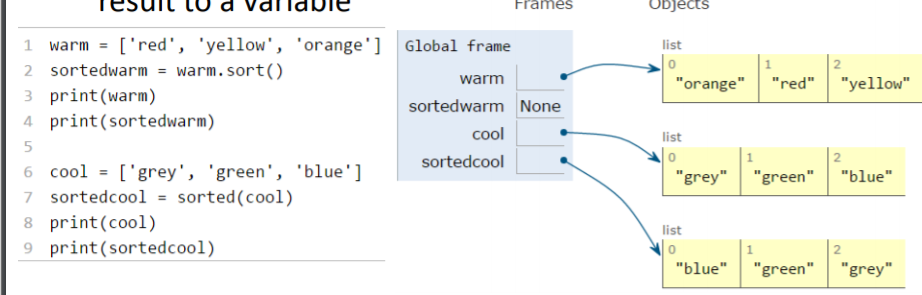

# 6-0001-fall-2016

> 이 프로젝트는 다음의 링크를 참고하여, 과제부분만 올리고 있습니다.  
>
> 원 강의 제목은 : Introduction to Computer Science and Programming in Python 입니다.
>
> https://ocw.mit.edu/courses/electrical-engineering-and-computer-science/6-0001-introduction-to-computer-science-and-programming-in-python-fall-2016/


# Lecture 4

> Decomposition, Abstraction and Functions


만약 엄청나게 많은 코드를 써야 한다면? 내용이 어지럽고, 하나 고칠때 하나하나 찾아 다녀야 한다. 더 많은 기능들을 더해라.

길이가 아니라 기능위주로 해야한다.


## Function

> Decomposition and Abstraction

프로젝터 예시

- 케이스
- 렌즈
- 환기시설

 이런 각각을 주어졌을때 프로젝트를 만들 수 있을까?


만약 그냥 완성품을 준다면 한시간 안에 어떻게 작동하는지 알아 낼 수 있는가.


블랙박스를 이용하기 위해 어떻게 작동하는지 알 필요는 없음. 블랙박스라고 생각하면 됨. 

Abstraction 어떻게 작동하는지 알 필요 없음.

## Decomposition

> 최종목표를 위해 다른 장비들이 함께 작동하는 것.

큰 이미지를 만들때, 작은 프로젝트를 여러개 합쳐서 하나의 이미지로 만드는 것. 

위 개념들을 프로그래밍에도 적용할 수 있음.

코드를 모듈로 나누는 것

- 재사용 가능함.

Class를 이용할 예정.


## Abstraction

> 코드 조각을 블랙박스로 생각하는것
>
> 프로젝터 예시에선 프로젝터를 사용하기 위해 작동원리를 알아야 할 필요는 없었던 것과 같음.

- 세부사항을 알 필요가 없음
- 세부사항을 알기 원할 필요가 없음.


## Function

> Function을 만드는 사람 vs Function을 사용하는 사람

재사용 가능한 코드를 만드는 것이 Functions

Called 또는 invoked 되기 전까지 Functions은 실행되지 않음

Function의 특징

- 이름을 가짐
- Parameter(변수)를 가짐
- docstring(설명서)을 가짐
- Body를 가짐
- 무언가 return 함.


## Function 정의와 사용

### Function 정의

```python
def is_even(i):
    """
    input : ~
    returns : ~
    """
    print("inside is_even")
    return i% == 0
    
is_even(3)
```

키워드,이름,인풋, 바디

`def`키워드

`is_even`이름

바디는 코드가 쓰인 부분

### Scope

Environment와 같다. Function의 Scope는 메인 프로그램과 완전히 별개다.

formal paramter = 인풋과 같음. `def f(x)`에서 `x`.

종이를 가지고 따라해보면 도움이 많이 된다.

#### 파이썬의 sequence

1. Global scope를 확인한다.
2. Def가 있으면 그냥 넘어간다.
3. function call이 있으면, new scope로 이동함
4. parameter를 mapping 한다.
   1. x가 특정 값을 받는다.
   2. 계산한다
   3. 계산한 값을 return한다
5. Global scope에서 받는다.


### Return이 없다면?

None이 return 됨. None이 string이 아님.


## Function as Arguments

파이썬의 모든 것은 Object이다. -> Integer, string, function도 

function을 function의 input으로 할 수 있음

```python
def func_a():
    print 'inside func_a'
def func_b(y):
    print 'inside func_b'
    return y
def func_c(z):
    print 'inside func_c'
    return z()

print func_a()
print 5 + func_b(2)
print func_c(func_a)
```

글로벌 스코프, 각자 스코프 왔다갔다 매핑을 하며 값을 계산한다.


## 다른 Scope에 있는 같은 이름의 variable

```python
def f(y):
    x = 1
    x +=1
    print(x)
x = 5
f(x)
print(x)

-> 2
```

globla scope의 x는 그대로임.


```python
def g(y):
    print(x)
    print(x+1)
    
x = 5
g(x)
print(x)
```

에러는 나지 않음. 잠시 스코프를 나가서, `x`를 찾아서 그 값을 내보냄. 문제는 안됨

```python
def h(y): 
    x += 1
    
x = 5
h(x)
print(h(x))
```

파이썬에서 허락되지 않은 방법. 에러가 나올 것이다.


## 더 어려운 Scope 관련된 것

www.pythontutor.com

요지는 local scope에서 global scope의 값을 가져올 수는 있지만 update는 할 수 없음.


# Lecture 5

> Tuples, List, Aliasing, Mutability, Cloning


## 2가지 새로운 데이터 타입

> 튜플과 리스트


## Tuple?

Sequence of something. Sequence of anything.

여러가지를 담을 수 있다.

바꿀 수 없음

### 만드는 방법

te = ()

t = (2,"mit",3)

t[0] -> 2

(2,"mit",3) + (5,6)  -> (2,"mit",3,5,6) 

t[1:2] -> ("mit",)  (,로 끝나는 것은 하나의 element를 가진 tuple 이라는 뜻)

t[1:3] -> ("mit",3)

len(t) -> 3

t[1] = 4 ->에러가 생김. 바꿀 수 없음. **immutable**


### 왜 튜플을 사용하는가?

#### 어떤 값을 swap 할때

```python
temp = x
x = y
y = temp
```

```python
(x,y) = (y,x)
```


#### Function에서 여러 값을 return 할떄

```python
def quotient_and_remainder(x, y):
    q = x //y
    r = x % y
    return (q, r)

(quot, rem) = quotient_and_remainder(4,5)
-> quot = 0, rem = 4
```


### 튜플 다루기

pre-condition: aTuple:((**ints**,*strings*),(**ints**,*strings*),(**ints**,*strings*))

```python
def get_data(aTuple):
    nums = ()
    words = ()
    for t in aTuple:
        nums = nums + (t[0],)
        if t[1] not in words:
            words = words + (t[1],)
    min_n = min(nums)
    max_n = max(nums)
    unique_words = len(words)
    return (min_n,max_n,unique_words)
```


### 예제

> 테일러 스위프트

```python
tswift=((2014,"Katy"),
       (2014,"Harry"),
       (2012,"Jake"),
       (2010,"Tayler"),
       (2008,"Joe"))
(min_year, max_year, num_people) = get_data(tswift)
print("From", min_year, "to", max_year,\
     "Taylor Swift wrote songs about", num_people, people!)

> From 2008 to 2014 Taylor Swift wrote songs about 5 people!
```


## List

> Mutable []


```python
a_list = []

L = [2, 'a', 4, [1,2]]
```

튜플과 String과 비슷하게 루프 가능


### Changing Element

```python
L = [2, 1, 5]
L[1] = 3
> L = [2, 3, 5]
```


### Iternation

```python
total = 0
for i in range(len(L)):
	total += L[i]
    print total
    
total = 0
for i in L:
	total += i
	print total
```


### OPERATIONS ON LISTS - ADD

 L.append(element)

```python
L = [2,1,3]
L.append(5) -> L is now [2,1,3,5]
```

`.`을 통해 기능을 부른다.


```python
L1 = [2,1,3]
L2 = [4,5,6]
L3 = L1 + L2 -> L3 is [2,1,3,4,5,6]
				L1, L2 unchanged
L1.extend([0,6]) -> mutated L1 to [2,1,3,0,6]
```


### OPERATIONS ON LISTS - REMOVE

delete element at a specific index with del(L[index])

 remove element at end of list with L.pop(), returns the removed element

remove a specific element with L.remove(element)

```python
L = [2,1,3,6,3,7,0] # do below in order
L.remove(2) -> mutates L = [1,3,6,3,7,0]
L.remove(3) -> mutates L = [1,6,3,7,0] 
del(L[1]) -> mutates L = [1,3,7,0]
L.pop() -> returns 0 and mutates L = [1,3,7]
```


### CONVERT LISTS TO STRINGS AND BACK

```python
s = "I<3 cs"
list(s) -> returns ['I','<','3',' ','c','s']
s.split('<') -> returns ['I', '3 cs']
L = ['a','b','c'] -> L is a list
''.join(L) -> returns "abc"
'_'.join(L) -> returns "a_b_c"
```


### OTHER LIST OPERATIONS

```python
L=[9,6,0,3]
sorted(L) -> returns sorted list, does not mutate L
L.sort() -> mutates L=[0,3,6,9]
L.reverse() -> mutates L=[9,6,3,0]
```


### ALIASES

hot is an alias for warm – changing one changes the other!

append() has a side effect


### CLONING A LIST

`chill = cool[:]`


### SORTING LISTS

`.sort()` Mutate -> return nothing

`.sorted()` Only return, no mutate



### LISTS OF LISTS OF LISTS OF….


### MUTATION AND ITERATION Try this in Python Tutor!


```python
def remove_dups(L1, L2):
	for e in L1:
		if e in L2:
			L1.remove(e)

def remove_dups(L1, L2):
	L1_copy = L1[:]
    for e in L1_copy:
        if e in L2:
            L1.remove(e)
            
L1 = [1, 2, 3, 4]
L2 = [1, 2, 5, 6]
remove_dups(L1, L2)
```

아래의 방법으로 해야한다. 왜냐하면 위의 방법은 리스트를 지움으로, 인덱스가 흐트러진다.
